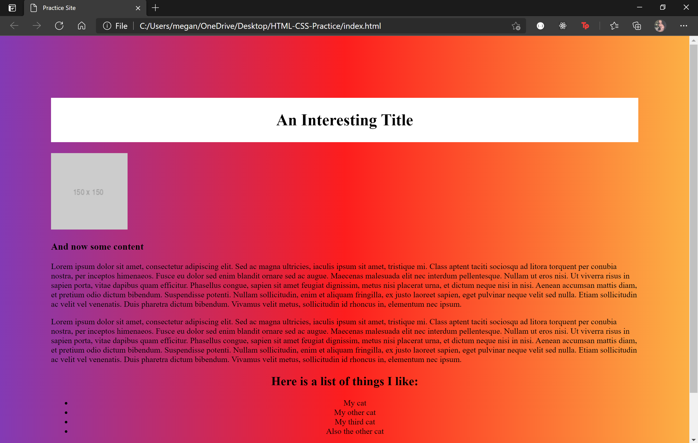

# HTML-CSS-Practice

## Description

This is a quick page designed to help Week One students recreate sites and learn HTML and CSS. They can look at the screenshot, research, and then attempt to recreate the page. Then, in Office Hours, they can show what they've done and review how they replicated each aspect of the site and ask questions on the parts they missed.

## Table of Contents 

* [Usage](#usage)

* [Picture](#picture)

* [License](#license)

* [Contributing](#contributing)

* [Tests](#tests)

* [Questions](#questions)

## Usage

To help other Week One/Two students practice

## Picture

  
## Contributing

We would appreciate if no contributions were made to this repo

## Tests

To run tests, run the following command:

```
No tests necessary
```

## Questions


If you have any questions about the repo, open an issue or contact [megannh6349](https://api.github.com/users/Megannh6349) directly.

